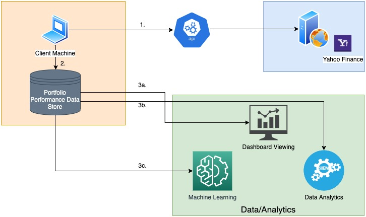
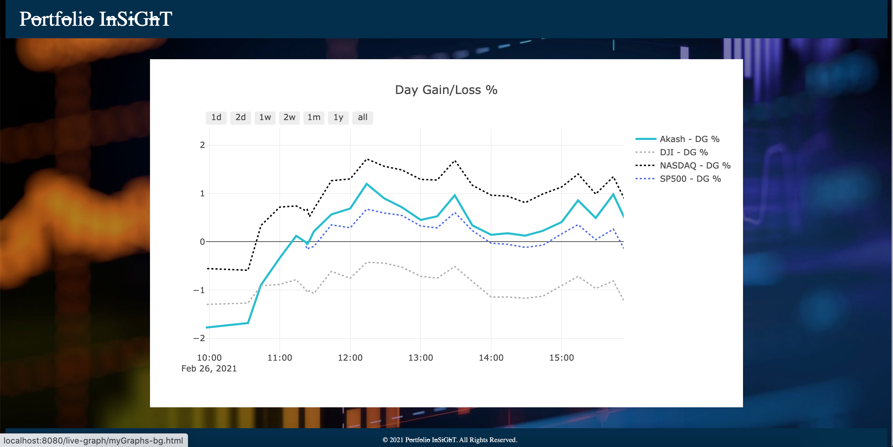
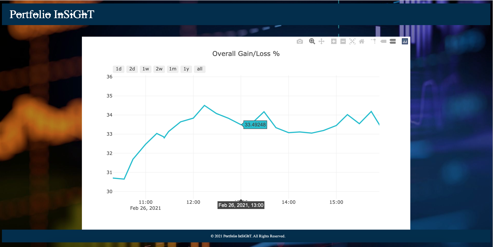

# Portfolio Insight
Portfolio Insight provides a live view/comparison of your portfolio performance against your friends, market indexes like SP500, DJI, NASDAQ, etc.

It also lets you store your portfolio performance data in raw form, which can be later used for analytical/machine learning purposes.

## High Level Design

## Screen1

## Screen2
